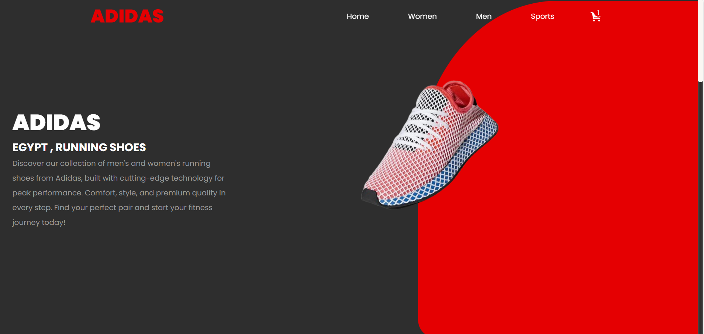
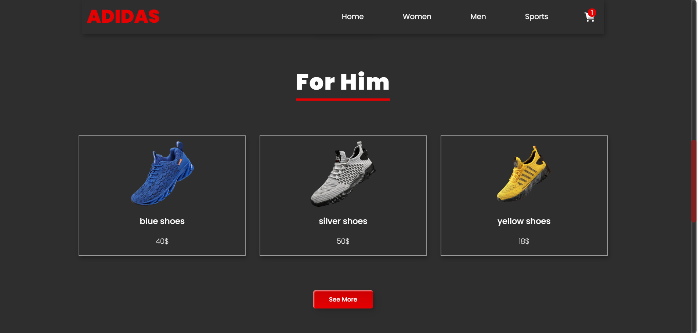
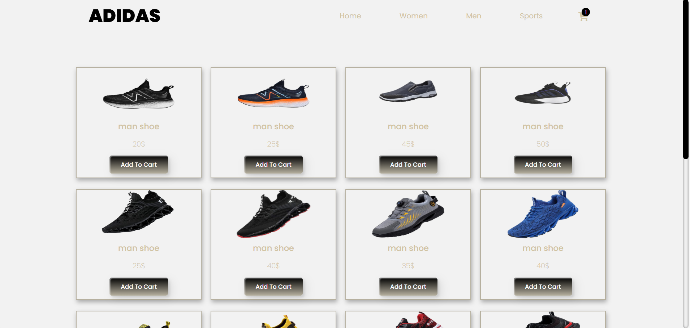
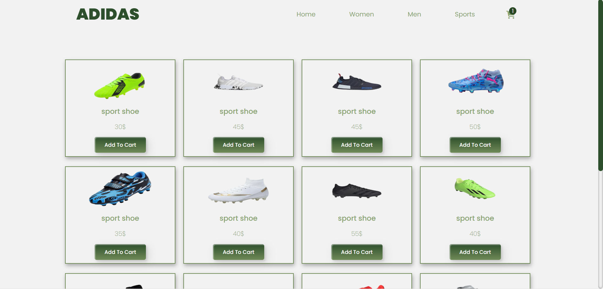
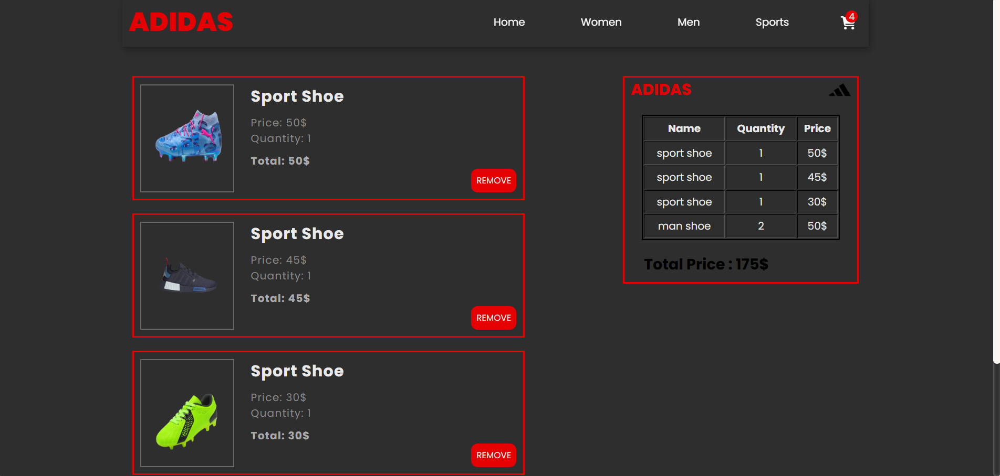
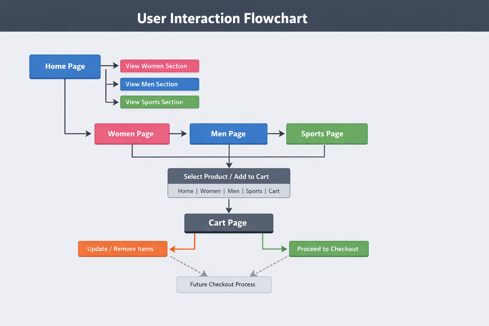

# 🏃 ADIDAS Egypt - Premium Running Shoes Store

A modern, responsive e-commerce website showcasing Adidas's premium collection of men's, women's, and sports running shoes with cutting-edge technology and iconic style.



---

## 📋 Table of Contents

- [Overview](#overview)
- [Features](#features)
- [Project Structure](#project-structure)
- [Technologies Used](#technologies-used)
- [Installation](#installation)
- [Usage](#usage)
- [Screenshots](#screenshots)
- [Project Pages](#project-pages)
- [SEO & Performance](#seo--performance)
- [Contact](#contact)
- [License](#license)

---

## 🎯 Overview

ADIDAS Egypt is a fully-functional e-commerce platform designed to provide customers with an exceptional shopping experience for premium running shoes. The website features an intuitive navigation system, organized product categories, and a responsive shopping cart system.

**Live Domain:** `https://www.adidas-egypt.com`

---

## ✨ Features

### Core Features

- ✅ **Responsive Design** - Mobile-first approach with seamless experience across all devices
- ✅ **Product Catalog** - Organized categories for Men, Women, and Sports shoes
- ✅ **Shopping Cart** - Full-featured cart management system with real-time updates
- ✅ **Product Database** - Dynamic product loading from JavaScript database
- ✅ **Navigation Header** - Sticky header with quick navigation and cart access

### SEO & Marketing

- ✅ **Meta Tags Optimization** - Comprehensive SEO meta tags for better search rankings
- ✅ **Open Graph Support** - Enhanced social media sharing with rich previews
- ✅ **Twitter Card Integration** - Optimized tweets for better engagement
- ✅ **Sitemap.xml** - Complete site structure for search engine crawlers
- ✅ **Robots.txt** - Search engine crawling instructions

---

## 📁 Project Structure

```
Adidas Project/
├── assets/
│   ├── images/
│   │   ├── banners/
│   │   │   └── home.png
│   │   ├── icons/
│   │   │   └── adidas.png
│   │   └── products/
│   │       ├── man1.png - man20.png
│   │       ├── woman1.png - woman12.png
│   │       └── sport1.png - sport16.png
│   └── styles/
│       ├── main.css
│       ├── layout/
│       │   └── header.css
│       └── pages/
│           ├── home.css
│           ├── men.css
│           ├── women.css
│           ├── sports.css
│           └── cart_details.css
├── public/
│   ├── index.html
│   ├── men.html
│   ├── women.html
│   ├── sports.html
│   ├── cart_details.html
│   ├── sitemap.xml
│   └── robots.txt
├── src/
│   ├── components/
│   │   └── header.js
│   ├── data/
│   │   └── productsDB.js
│   └── pages/
│       ├── home.js
│       ├── cart.js
│       └── main.js
├── docs/
│   └── images/
└── README.md
```

---

## 🛠 Technologies Used

| Category            | Technology                      |
| ------------------- | ------------------------------- |
| **Frontend**        | HTML5, CSS3, Vanilla JavaScript |
| **Icons**           | Font Awesome 6.7.2              |
| **Styling**         | Custom CSS with Flexbox/Grid    |
| **Version Control** | Git                             |
| **SEO**             | Meta tags, Sitemap, Robots.txt  |

---

## 🚀 Installation

### Prerequisites

- Node.js (v14 or higher)
- Git
- Any modern web browser
- Code Editor (VS Code recommended)

### Steps

1. **Clone the Repository**

   ```bash
   git clone https://github.com/yourusername/adidas-egypt.git
   cd adidas-egypt
   ```

2. **Start Local Server**

   ```bash
   # Using Python
   python -m http.server 8000

   # Or using Node.js
   npx http-server

   # Or using VS Code Live Server extension
   # Right-click index.html > Open with Live Server
   ```

3. **Access the Website**
   ```
   http://localhost:8000/public/index.html
   ```

---

## 💻 Usage

### Browsing Products

1. Navigate to the **Home** page to see featured products
2. Click on category cards or menu items to view:
   - **Men's Collection** - Premium men's running shoes
   - **Women's Collection** - Stylish women's athletic footwear
   - **Sports Collection** - High-performance sports shoes

### Shopping Cart

1. Click on any product to add it to your cart
2. Navigate to the **Cart Details** page to review your items
3. View product names, quantities, and prices
4. See the total price calculation

### Product Information

- Each product displays: Name, Image, and Price
- Hover effects for enhanced user interaction
- Smooth transitions and animations

---

## 📸 Screenshots

### Home Page



### Men's Collection



### Women's Collection


### Sports Collection



### Shopping Cart



### User Interaction



---

## 📄 Project Pages

| Page              | URL                  | Purpose                              |
| ----------------- | -------------------- | ------------------------------------ |
| **Home**          | `/index.html`        | Landing page with featured products  |
| **Men's Shoes**   | `/men.html`          | Browse all men's running shoes       |
| **Women's Shoes** | `/women.html`        | Browse all women's athletic footwear |
| **Sports Shoes**  | `/sports.html`       | Browse high-performance sports shoes |
| **Cart Details**  | `/cart_details.html` | Review and manage shopping cart      |

---

## 🔍 SEO & Performance

### Search Engine Optimization

- ✅ Comprehensive meta descriptions for each page
- ✅ Targeted keywords for improved ranking
- ✅ Open Graph meta tags for social sharing
- ✅ Twitter Card integration
- ✅ XML Sitemap for crawler discovery
- ✅ Robots.txt for crawl management

### Performance Features

- ✅ Responsive design (Mobile, Tablet, Desktop)
- ✅ Optimized image assets
- ✅ Minimal CSS/JS for fast loading
- ✅ Semantic HTML structure
- ✅ Font Awesome icons (minimal request)

---

## 📊 Product Database

### Sample Products

- **Men's Shoes**: 20+ products ranging from $18-$50
- **Women's Shoes**: 12+ products ranging from $30-$50
- **Sports Shoes**: 16+ products ranging from $45-$60

All products are dynamically loaded from `src/data/productsDB.js`

---

## 🎨 Design Features

- **Color Scheme**: Professional black, white, and brand colors
- **Typography**: Clean, readable fonts
- **Hover Effects**: Smooth transitions on product cards
- **Animations**: Subtle transitions for better UX
- **Icons**: Font Awesome for consistent iconography
- **Layout**: Mobile-first responsive grid system

---

## 🔧 Key Components

### Header (`src/components/header.js`)

- Sticky navigation bar
- Quick navigation links
- Shopping cart access
- Responsive menu

### Product Database (`src/data/productsDB.js`)

- Centralized product information
- Easy to update and maintain
- Structured product categories

### Page Scripts (`src/pages/`)

- `main.js` - Product page rendering
- `home.js` - Home page functionality
- `cart.js` - Shopping cart management

---

## 📱 Browser Support

- Chrome (Latest)
- Firefox (Latest)
- Safari (Latest)
- Edge (Latest)
- Mobile browsers (iOS Safari, Chrome Mobile)

---

## 🤝 Contributing

Contributions are welcome! Please follow these steps:

1. Fork the repository
2. Create a feature branch (`git checkout -b feature/AmazingFeature`)
3. Commit changes (`git commit -m 'Add AmazingFeature'`)
4. Push to branch (`git push origin feature/AmazingFeature`)
5. Open a Pull Request

---

## 📞 Contact

**Project Author**: Nourhan Ibrahim Atlam
**Email**: nourhanatlam492@gmail.com  
**Location**: Tanta, Egypt  
**Phone**: +20 1553724887

### Follow Us

- [Facebook](https://www.facebook.com/share/1DCufHcZpj/)
- [Instagram](https://www.instagram.com/atlamnourhan?igsh=NnN4b2Y2NXZvOHZy)
- [LinkedIn](https://www.linkedin.com/in/nourhan-atlam-5b8134339/)

---

## 📜 License

This project is licensed under the **MIT License** - see the LICENSE file for details.

**© 2025 Adidas Egypt. All rights reserved.**

---

## 🙏 Acknowledgments

- Font Awesome for comprehensive icon library
- Adidas brand for inspiration
- Open-source community for tools and resources

---

## 📈 Future Enhancements

- [ ] User authentication system
- [ ] Payment gateway integration
- [ ] Product reviews and ratings
- [ ] Wishlist functionality
- [ ] Advanced search filters
- [ ] Order tracking
- [ ] Admin dashboard
- [ ] Email notifications

---

**Happy Shopping! 🛍️**